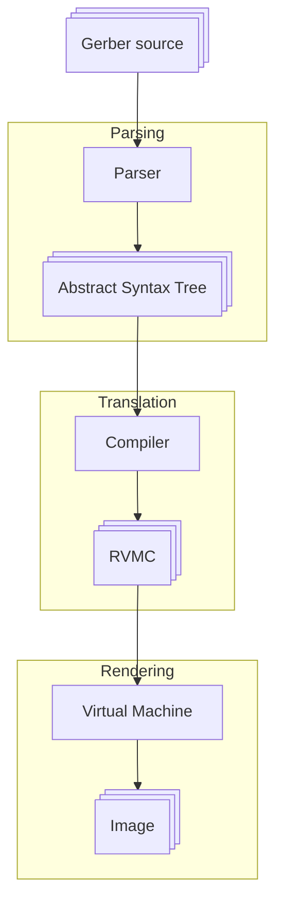
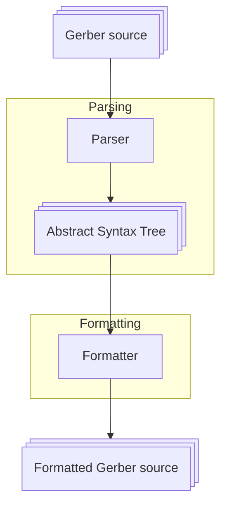

# 🧭 Introduction

## Overview

Welcome to the documentation of Gerber tooling within PyGerber library. This part of
documentation will cover most of the features of PyGerber which have to do with
consuming and changing Gerber files.

In particular, you can learn here how to:

- [quickly render PNGs, JPEGs or SVGs from Gerber files](./20_quick_start/01_single_file.md),
- [stack many of them on top each other so they align well](./20_quick_start/02_multi_file.md),
- [consume Gerber Job files](./20_quick_start/03_project_gerber_job.md),
- [perform analysis of Gerber files](./30_analysis/00_introduction.md),
- [modify them](./40_modify_optimize/00_introduction.md),
- [and format them](./60_formatter/00_introduction.md),
- [collect diagnostics](./70_diagnostics/00_introduction.md),
- [use language server](./80_language_server/00_introduction.md),
- [or even extend PyGerber](./90_extend/00_introduction.md).

Generation of Gerber files is covered separately by
[Gerber code generation](../80_code_generation/00_introduction.md) guide.

Adding rendering backends is covered by documentation of
[Virtual Machines](../60_rendering_backends/00_introduction.md).

## Design overview

In this section we will cover the general design of Gerber tooling within PyGerber.
Let's start with basic stages of Gerber processing which have to be performed to create
PNG image out of Gerber file.

### Parser

First of all, Gerber files have to be loaded into memory and parsed into
[Abstract Syntax Tree](https://en.wikipedia.org/wiki/Abstract_syntax_tree) (AST). This
is done by a parser, currently PyGerber has only one Gerber parser, based on
[pyparsing](https://pypi.org/project/pyparsing/) library, available as
[`pygerber.gerber.parser.pyparsing.Parser`](../reference/pygerber/gerber/parser/pyparsing/parser.md#pygerber.gerber.parser.pyparsing.parser.Parser)
class. Currently work is being done to provide plugin interface which would allow to use
parsers implemented as separate packages. Alongside that initiative, a
[C++ based Gerber parser](https://github.com/PyGerber/pygerber_gerber_parser_cpp) is
being implemented.

### Compiler

After obtaining AST it is converted to a special assembly like format called Rendering
Virtual Machine Commands (RVMC). This conversion is handled by a
[Compiler](../reference/pygerber/gerber/compiler/compiler.md#pygerber.gerber.compiler.compiler.Compiler)
class. RVMC representation is much simpler, it does not differentiate between
rectangles, obrounds, circles and other Gerber constructs, but rather represents
everything as shapes built out of lines and arcs. This simplification allows it to be
very generic and quite easy to implement.

### Virtual Machine

Once RVMC is obtained, it is passed to one of the classes inheriting from
[VirtualMachine](../reference/pygerber/vm/vm.md#pygerber.vm.vm.VirtualMachine) class,
which are responsible for "executing" the RVMC (nomenclature based on analogy to
executing assembly code). Depending on the VM chosen, there are different configuration
options available and different type of image will be obtained. Since at the begging we
assumed we want to walk through the process of rendering PNG image, we would have to
choose
[PillowVirtualMachine](../reference/pygerber/vm/pillow/vm.md#pygerber.vm.pillow.vm.PillowVirtualMachine),
which is capable of rendering raster images with
[Pillow](https://pypi.org/project/pillow/) library and exporting them in different
raster formats.

## Additional processing

Although rendering is probably the most useful feature of PyGerber, it is not the only
one. PyGerber is capable of performing analysis, formatting and modification of existing
Gerber files. This is done by different classes, which are not part of the rendering
pipeline. All those tools require AST as input, so you have to first parse Gerber file
before you can use them. For example here is processing flow for formatting:

