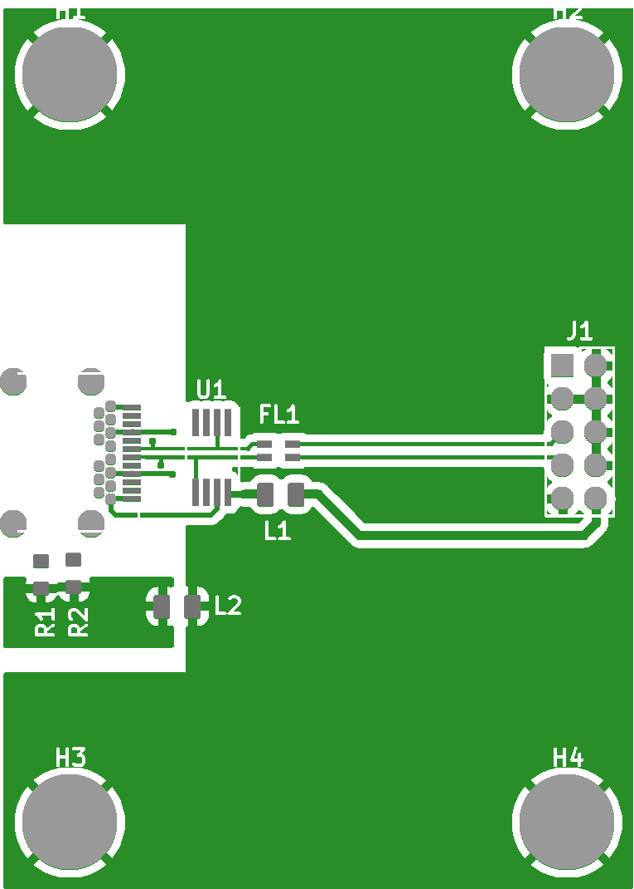
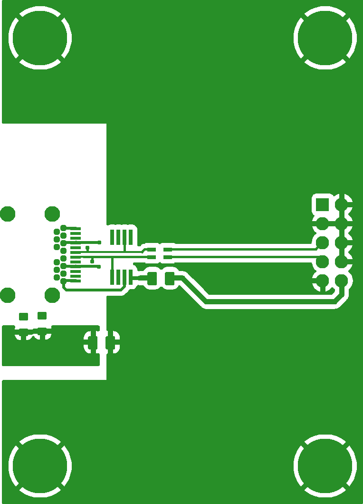

# Multi file guide

This guide shows how to use `CompositeView` class in par with `GerberFile` class to
operate on multiple Gerber files at once.

## Creating `CompositeView` instance

[`CompositeView`](../../reference/pygerber/gerber/api/__init__.md#pygerber.gerber.api.CompositeView)
class is a thin wrapper around multiple
[`GerberFile`](../../reference/pygerber/gerber/api/__init__.md#pygerber.gerber.api.GerberFile)
objects. Usually it does not make sense to operate on all files from project at once,
since rendering **top** layers on top of **bottom** ones will produce hard to understand
images. It makes more sense to render them separately. Therefore `CompositeView` is a
way to group files that should be rendered together, for example all parts of **top** of
PCB, silkscreen, solder mask, top copper etc. while parts of **bottom** of PCB are
grouped in separate `CompositeView`, so do internal layers.

`CompositeView` constructor accepts multiple `GerberFile` objects as arguments. First
`GerberFile` is the bottom most, usually copper layer, and last `GerberFile` is top
most, usually silk screen. Here is an example:

{{ include_code("test/examples/gerberx3/api/_70_multi_file_constructor_showcase.project.py", "docspygerberlexer", title="create_project.py", linenums="1") }}

{{ run_capture_stdout("python test/examples/gerberx3/api/_70_multi_file_constructor_showcase.project.py", "python create_project.py") }}

## Rendering raster images

Image rendering API of `CompositeView` object is similar to rendering API of
`GerberFile` object. `CompositeView` object exposes `render_with_pillow()` method which
renders all files into single image.

`CompositeView` automatically aligns all images during grouped rendering, determines how
big final image has to be to fit all images and merges them into single image. It is
still possible to retrieve individual images from result returned by rendering methods.

{{ include_code("test/examples/gerberx3/api/_71_multi_file_render_with_pillow.example.py", "docspygerberlexer", title="render_project.py", linenums="1") }}

    

Image presented above is a result of rendering Gerber files from this project:
[github.com/AntonioMR/ATMEGA328-Motor-Board](https://github.com/AntonioMR/ATMEGA328-Motor-Board)

## Accessing individual images

After rendering a image with `CompositeView` object you can still access individual
images by using
[`get_sub_images()`](../../reference/pygerber/gerber/api/__init__.md#pygerber.gerber.api.CompositePillowImage.get_sub_images)
method available on
[`CompositePillowImage`](../../reference/pygerber/gerber/api/__init__.md#pygerber.gerber.api.CompositePillowImage)
object returned by `render_with_pillow()` method.

{{ include_code("test/examples/gerberx3/api/_72_multi_file_render_with_pillow_single_file_access.example.py", "docspygerberlexer", title="render_project.py", linenums="1") }}

    

## Further reading

Check out full reference of
[`pygerber.gerber.api`](../../reference/pygerber/gerber/api/__init__.md).
