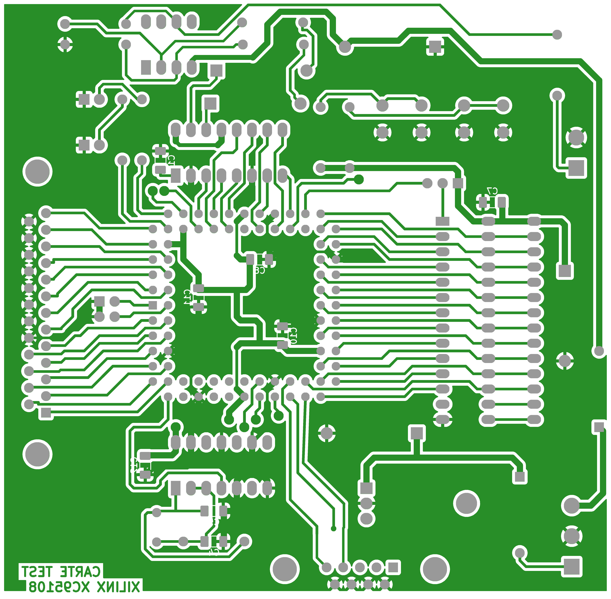

# GerberJobFile and Project

This guide shows how to use `GerberJobFile` class and `Project` to represent PCB
projects.

## GerberJobFile

PyGerber provides a `GerberJobFile` class to directly handle `.gbrjob` files usually
exported alongside Gerber files. You can find
[The Gerber Job Format Specification](https://www.ucamco.com/files/downloads/file_en/435/gerber-job-format-specification-revision-2020-08_en.pdf)
at [www.ucamco.com](https://www.ucamco.com). Attributes of `GerberJobFile` directly map
to values in `.gbrjob` file. You can create `GerberJobFile` manually by constructing it
out of classes imported from `pygerber.gerber.api` or you can load existing `.gbrjob`
file with `from_file()` method.

{{ include_code("test/examples/gerberx3/api/_80_gbrjob.no_output.py", "docspygerberlexer", title="example.py", linenums="1") }}

{{ run_capture_stdout("python test/examples/gerberx3/api/_80_gbrjob.no_output.py", "python example.py") }}

## PyGerber Project class

`Project` class is a container for `CompositeView` objects. It is primarily a utility
for grouping `CompositeView` objects together, it doesn't really fit into PCB design
workflow but can be really handy to express what should be rendered together while
creating images of PCBs.

`Project` has `top`, `bottom` read-only attributes which containing `CompositeView`
objects and `inner` read-only attribute containing tuple of `CompositeView` objects
representing inner layers. Layers in `inner` are ordered first to last, `L1` at index
`0`, `Ln` at index `n`.

## Converting GerberJobFile to Project

`GerberJobFile` can be converted to `Project` object with `to_project()` method. This
will automatically read layers from `GerberJobFile` and arrange them in `Project` object
so they can be rendered.

{{ include_code("test/examples/gerberx3/api/_81_gbrjob_to_project.no_output.py", "docspygerberlexer", title="example.py", linenums="1") }}

{{ run_capture_stdout("python test/examples/gerberx3/api/_81_gbrjob_to_project.no_output.py", "python example.py") }}

Here is image generated by code above:

    

As you can see, during conversion `copper`, `soldermask`, `legend` and `profile` (edge
cuts) files corresponding to top part of PCB were recognized. Be aware that
`MaterialStackup` field is currently not taken into account while converting
`GerberJobFile` to `Project`, so no information about materials or colors is retained.

## PCB design disclaimer

Gerber files `carte_test-*` were generated from KiCad demo project `test_xil_95108`.

[LICENSE.README](https://github.com/KiCad/kicad-source-mirror/blob/master/LICENSE.README)
in KiCad repository states:

> Licensed under CC BY-SA 4.0:
>
> - All the demo files provided in demos/\*
