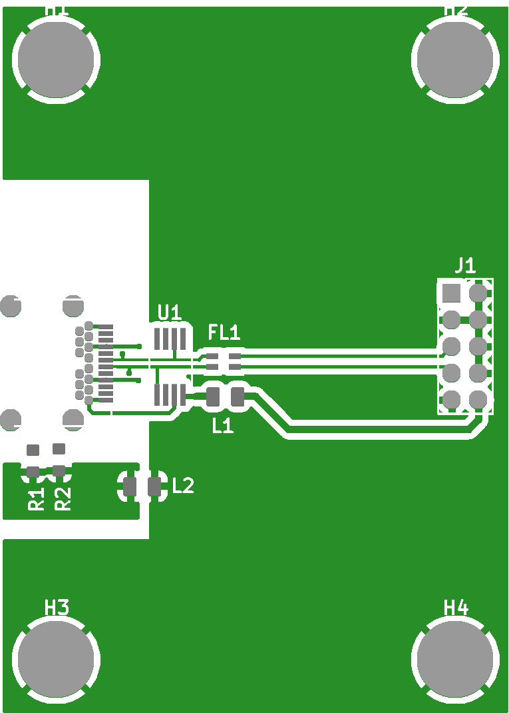

# Multi file project guide

This guide shows how to use `Project` class in par with `GerberFile` class to render
multiple Gerber files into single, aligned image.

## Creating Project instance

[`Project`](../../reference/pygerber/gerber/api/__init__.md#pygerber.gerber.api.Project)
class is a simple wrapper around multiple
[`GerberFile`](../../reference/pygerber/gerber/api/__init__.md#pygerber.gerber.api.GerberFile)
objects. It automatically aligns all images and determines how big final image has to be
to fit all images and merges them into single image. It is still possible to retrieve
individual images from result returned by rendering methods.

To create `Project` object you can use `Project` constructor. It accepts list of
`GerberFile` objects as its only parameter.

{{ include_code("test/examples/gerberx3/api/_70_project_constructor_showcase.project.py", "docspygerberlexer", title="create_project.py", linenums="1") }}

{{ run_capture_stdout("python test/examples/gerberx3/api/_70_project_constructor_showcase.project.py", "python create_project.py") }}

## Rendering Project

Rendering `Project` object is similar to rendering `GerberFile` object. `Project` object
exposes `render_with_pillow()` method which renders all files into single image.

{{ include_code("test/examples/gerberx3/api/_71_project_render_with_pillow.example.py", "docspygerberlexer", title="render_project.py", linenums="1") }}

    

## Accessing individual images

After rendering `Project` object you can access individual images by using
[`get_sub_images()`](../../reference/pygerber/gerber/api/__init__.md#pygerber.gerber.api.CompositeImage.get_sub_images)
of
[`CompositeImage`](../../reference/pygerber/gerber/api/__init__.md#pygerber.gerber.api.CompositeImage)
object returned by `render_with_pillow()` method.

`TODO: Add example`

## Further reading

Check out full reference of
[`pygerber.gerber.api`](../../reference/pygerber/gerber/api/__init__.md).
