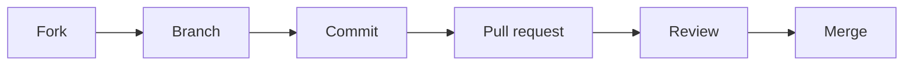

# Contribution guidelines

Recommended way to contribute to PyGerber is to fork the repository, create a new
branch, make changes and submit a pull request. After submitting a pull request, one of
PyGerber maintainers will review it and possibly allow CI to run tests on your changes.



Maintainer may ask for additional changes or provide feedback on your pull request.
Please be patient and polite, maintainers are volunteers and they may not be able to
respond immediately. If you are not sure about something, feel free to ask for help in
the pull request comments. We encourage open and respectful communication.

When requested to make changes to your pull request, please do so in a new commit. This
will allow maintainers to easily see what has changed since last review.

!!! warning

    Avoid force pushing and squashing existing commits unless asked to do so. Those
    operations obfuscate history and make it harder to incrementally review changes.

Within continuous integration pipeline PyGerber runs tests on multiple Python versions,
multiple platforms and verifies code quality with tools listed in
`.pre-commit-config.yaml`. If your changes do not pass tests or code quality checks, you
will be asked to fix them before your pull request can be merged. We recommend you to
run tests locally before submitting a pull request to make the process quicker.

{{ include_code(".pre-commit-config.yaml", "yaml", title=".pre-commit-config.yaml", linenums="1") }}

!!! warning

    Before trying to run those commands, have look at [Environment setup](./10_env_setup.md).

To run style checks locally, you can use following commands:

```bash
poe test-style
```

!!! warning

    This will run all code quality related checks, but does not include any of behavior
    (unit or end to end) tests.

To run unit and end to end tests, use following commands:

```bash
poe test-all
```

!!! warning

    `test-all` target does **not** include style checks itself, they have to be run
    separately.

When adding new features, please include necessary documentation updates and test cases.
Tests are necessary for even smallest changes to avoid regressions, ensuring that your
changes will continue to function as expected in the future. Test cases should provide
coverage of your change close to 90%. Coverage is reported at the end of `test-all` run.

For reference, here is an example of coverage report:

```
---------- coverage: platform linux, python 3.8.18-final-0 -----------
Name                                                       Stmts   Miss  Cover   Missing
----------------------------------------------------------------------------------------
src/pygerber/__main__.py                                       4      4     0%   3-8
src/pygerber/builder/gerber.py                               425     30    93%   215, 243, 246, 266, 415-418, 429, 637, 891, 913, 932, 938-939, 942-943, 946-947, 952, 997-998, 1448-1459, 1570-1571, 1640, 1680, 1729, 1745
src/pygerber/builder/rvmc.py                                  88     16    82%   105-109, 119-124, 175-176, 179-180, 208-209, 236-237, 275-276, 295-296
src/pygerber/common/error.py                                   4      1    75%   10
src/pygerber/common/position.py                               43     43     0%   3-83
src/pygerber/console/commands.py                              38      4    89%   21-26
src/pygerber/gerber/api/_composite_view.py                    35      1    97%   95
src/pygerber/gerber/api/_enums.py                             68      7    90%   123, 129, 136-137, 142, 145, 148
src/pygerber/gerber/api/_gerber_file.py                      224     24    89%   109, 114, 122, 130, 248, 278, 283, 309, 329, 398-399, 474, 479-492, 499, 537, 560
src/pygerber/gerber/api/_gerber_job_file.py                  119      4    97%   146, 191, 209, 218
src/pygerber/gerber/api/_project.py                           19      1    95%   42
src/pygerber/gerber/ast/ast_visitor.py                       387      3    99%   781, 794, 798
src/pygerber/gerber/ast/errors.py                             32      5    84%   28, 47-48, 57-58
src/pygerber/gerber/ast/expression_eval_visitor.py            59      3    95%   100-102
src/pygerber/gerber/ast/node_finder.py                        61      6    90%   51, 54-55, 68-69, 92
src/pygerber/gerber/ast/nodes/aperture/AB.py                  13      1    92%   32
src/pygerber/gerber/ast/nodes/aperture/AM.py                  13      1    92%   32
src/pygerber/gerber/ast/nodes/aperture/SR.py                  13      1    92%   32
src/pygerber/gerber/ast/nodes/attribute/TA.py                 53      3    94%   24, 36, 106
src/pygerber/gerber/ast/nodes/attribute/TF.py                107      4    96%   27, 39, 216, 225
src/pygerber/gerber/ast/nodes/attribute/TO.py                159     14    91%   25, 37, 123, 144, 165, 186, 207, 228, 249, 270, 291, 312, 333, 357
src/pygerber/gerber/ast/nodes/base.py                         35      4    89%   45, 52, 57, 78
src/pygerber/gerber/ast/nodes/enums.py                       124      2    98%   78, 124
src/pygerber/gerber/ast/nodes/invalid.py                       9      2    78%   22, 28
src/pygerber/gerber/ast/nodes/math/constant.py                16      1    94%   32
src/pygerber/gerber/ast/nodes/math/parenthesis.py              9      1    89%   30
src/pygerber/gerber/ast/state_tracking_visitor.py            451     55    88%   125-126, 130, 135, 190, 195, 214, 238, 317, 360, 435, 501, 509, 517, 525, 667-668, 765-767, 787, 794-799, 843, 852, 861, 870, 877-879, 896-898, 902-904, 908-910, 914-917, 927-930, 934-937, 950
src/pygerber/gerber/compiler/compiler.py                     453     26    94%   155, 183-196, 355, 480, 500, 515-525, 553, 631, 689, 709, 878-883, 913, 921, 924, 1023-1024
src/pygerber/gerber/compiler/errors.py                        15      6    60%   21-26, 33-34, 41
src/pygerber/gerber/formatter/formatter.py                   942     50    95%   219, 252, 259, 271, 278, 287, 292, 297, 321-330, 346-348, 352-357, 361-363, 369-370, 380, 587-588, 813-817, 840-844, 977, 985, 1124, 1133, 1267-1268, 1281-1282
src/pygerber/gerber/parser/__init__.py                        11      2    82%   74-75
src/pygerber/gerber/parser/pyparsing/grammar.py              387      7    98%   217, 220, 228, 253, 256, 1220, 1267
src/pygerber/gerber/pygments.py                               34     34     0%   3-191
src/pygerber/gerber/spec/rev_2024_05.py                      257     20    92%   15, 20, 34, 39-40, 45, 261, 269, 277, 285, 292, 299, 306, 313, 320, 328, 336, 344, 352, 360
src/pygerber/vm/__init__.py                                   15      2    87%   38-39
src/pygerber/vm/commands/shape_segments/shape_segment.py      11      2    82%   24, 28
src/pygerber/vm/pillow/errors.py                               7      2    71%   16-19
src/pygerber/vm/pillow/vm.py                                 154     10    94%   52, 58-59, 71-72, 88, 198, 230, 311, 361
src/pygerber/vm/rvmc.py                                        8      1    88%   19
src/pygerber/vm/shapely/vm.py                                171     11    94%   41-42, 63, 89-93, 140, 167, 209, 325, 364
src/pygerber/vm/types/color.py                                63     22    65%   131-154, 167, 171
src/pygerber/vm/types/layer_id.py                             10      1    90%   20
src/pygerber/vm/types/matrix.py                               53      2    96%   114, 122
src/pygerber/vm/types/model.py                                 8      1    88%   23
src/pygerber/vm/types/vector.py                               94     11    88%   45, 58, 68, 78, 84, 90, 96, 102, 108, 167-169
src/pygerber/vm/vm.py                                        147      1    99%   299
----------------------------------------------------------------------------------------
TOTAL                                                       6835    452    93%

126 files skipped due to complete coverage.

===== 1583 passed, 28 skipped, 14 xfailed, 2 warnings in 586.85s (0:09:46) =====
generating index: 726/727
```

Parts of code that are not covered will have to be marked with `# pragma: no cover`. Be
prepared to justify to maintainers why you didn't cover those parts of code if they ask
about it.

In most cases after complying with requirements mentioned above, your pull request will
be merged by one of the PyGerber maintainers. We will make sure to include you in the
`CHANGELOG.md` and release notes.

PyGerber maintainers reserve the right to reject any pull request without providing
reasons. However, they will try to provide feedback and guidance on how to improve your
contribution.

Please comply with
[GitHub Community Guidelines](https://docs.github.com/en/site-policy/github-terms/github-community-guidelines)
while contributing to PyGerber.
