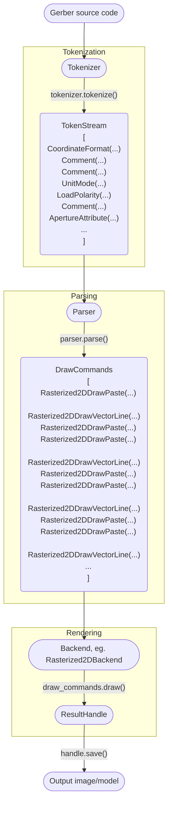

# PyGerber internal API V1 (legacy)

!!! warning "Deprecation warning"

    API V1 is legacy API, it will be removed in PyGerber 3.0.

## Stability

PyGerber's Gerber internal API is not as stable as high level API. This is because the
implementation of subsequent functionalities may force changes in the structure of the
code. However, our goal is to guarantee internal API **stability between patch**
releases.

!!! warning "Security"

    In case of **security vulnerability**, patch update **may** introduce API break to guarantee
    safety of users. Such case will be mentioned in [Changelog](../Changelog.md). If it
    was not mentioned in Changelog,
    [please report it](https://github.com/Argmaster/pygerber/issues/new).

When comes to minor releases, it will depend on features implemented. We will explicitly
note weather subsequent minor release is considered compatible with previous one, but it
would be unsafe to assume that all releases will be compatible. Therefore we recommend
to our users to configure their automatic updates to only automatically suggest patches
while leaving minor releases for manual review.

!!! bug "Incompatible patches"

    [Please report](https://github.com/Argmaster/pygerber/issues/new) API breaks
    introduced in patches, unless they were mentioned in [Changelog](../Changelog.md)
    with justification.

## Internal execution model

PyGerber divides the processing of a Gerber file into three stages. In this chapter we
will discuss what are those stages and how each of them work. As a starting point, to
make it easier to get a general idea on PyGerber's internal structure we have provided
simplified flowchart of it:

## Stages

### Tokenization

Tokenization is a fundamental process in the field of formal language processing. It
involves breaking down a sequence of characters (like a source code) into smaller
chunks, known as tokens. Each token represents a coherent sequence of characters that
symbolize a fundamental entity in the language, like keywords, operators, or
identifiers.

#### PyGerber's Tokenization Framework

In the PyGerber library, the tokenization process is tailored to parse the Gerber X3/X2
format, which is a widely used standard for PCB (Printed Circuit Board) data files. The
library uses a combination of predefined grammar rules and token classes to achieve
this.

**Core Components**:

1. **Tokenizer Class**: The main driver behind the tokenization process. It offers
   methods like `tokenize` and `tokenize_expressions` to convert source code into a
   stack of tokens.

2. **Grammar Definitions**: Housed in `grammar.py`, these provide the rules to recognize
   various constructs in the Gerber X3/X2 format. The library employs the `pyparsing`
   module to facilitate this.

3. **Token Class**: An abstract base class in `token.py`, which serves as the foundation
   for all token types in the library. It provides methods for wrapping parsing
   expressions, initializing tokens from parsed results, and offers basic string
   representations for debugging.

4. **Concrete Token Classes**: These are implementations of the abstract `Token` class.
   Each of these corresponds to a specific construct in the Gerber X3/X2 format. For
   instance, `DNNSelectAperture` in `dnn_select_aperture.py` is a token representing the
   aperture select command in the format.

#### Tokenization Flow:

Tokenization in PyGerber follows a sequence of steps visualized in the mermaid graph
present in this document. Here's a high-level overview:

1. The source code of a Gerber file is fed into the `Tokenizer`.
2. Using the grammar rules, the `Tokenizer` breaks down the source into meaningful
   chunks.
3. Each chunk is matched against a specific token class based on the grammar.
4. The matched tokens are then collected into a `TokenStack`.
5. Post-tokenization, this stack of tokens can be used for various purposes, like
   rendering, linting, or further parsing.

### Parsing

Once the Gerber X3/X2 source code has been tokenized, the next crucial step is parsing.
The `Parser` class plays a pivotal role in this phase, ensuring the sequence of tokens
is processed to generate meaningful and actionable structures.

#### The Process:

1. **Parsing the Token Stack**: The `Parser` class processes the token stack produced by
   the tokenizer. It ensures that the token sequence conforms to the grammar rules of
   the Gerber X3/X2 format. As it progresses through the stack, it translates the tokens
   into a set of drawing commands that encapsulate the instructions embedded within the
   source code.

2. **State Management**: An integral aspect of the parsing process is the management of
   the drawing state. The `State` class, found in `state.py`, maintains the current
   state of the drawing. Each token parsed potentially updates this state by
   implementing `update_drawing_state()` method. This method returns two things:

   - New instance of state if state modification was necessary or old one if it was not.
   - Iterable of drawing commands which apply visual changes to rendering target.

3. **Error Handling**: Robust error handling mechanisms are embedded within the parser.
   It's equipped to detect discrepancies or violations in the token sequence. If the
   sequence doesn't adhere to the expected grammar or if certain tokens are missing, the
   parser raises specific exceptions to flag these issues.

4. **Generating Drawing Commands**: Post-parsing, a sequence of drawing commands is
   produced. These commands serve as a bridge between the Gerber X3/X2 format and the
   rendering engines or other components of the PyGerber library. They are primed for
   further processing or visualization.

---

### Rendering

After the GerberX3 source code has been tokenized into individual units and subsequently
parsed into meaningful structures, the next pivotal step is rendering. This step
visualizes the abstract representation of the Gerber file.

#### Backend Infrastructure:

The essence of the rendering process in PyGerber is encapsulated within its backend
infrastructure. This subsystem bridges the gap between the abstract parsed structures
and their visual representations.

1. **BackendOptions**:

   - **Description**: A utility class furnishing additional configurations that can
     influence the rendering process, such as paths for dumping aperture data or other
     specific render settings.

2. **Backend**:

   - **Description**: This abstract base class stands as the linchpin of the rendering
     process. It amalgamates the essential attributes and methods imperative for
     visualization.
   - **Key Features**:
     - **Aperture Management**: It safeguards a list of aperture handles and proffers
       methods to both generate and access these handles.
     - **Drawing Execution**: This core feature takes a suite of drawing commands and
       metamorphoses them into their respective visual forms.
     - **Bounding Area**: By preserving a bounding box, the backend delineates the
       spatial constraints of the drawing.
     - **Coordinate Management**: Orchestrating the coordinate system's origin, it
       ensures the precise alignment and placement of visual elements.

3. **Extensions & Implementations**:
   - The generic interface provided by `Backend` lays the foundation. Concrete
     implementations, tailored to particular rendering techniques—whether rasterized 2D
     visuals via Pillow, vector illustrations using drawsvg, or 3D models with
     Blender—build upon this foundation. They take the drawing commands and adapt them
     to their unique visualization mediums.

---
