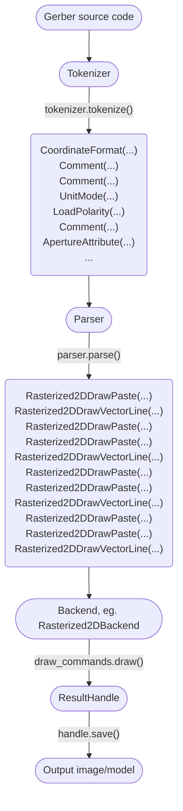

# Internal Execution Model

PyGerber divides the processing of a Gerber file into three stages. The first of them is
Tokenization during which the source code is broken into short characteristic fragments
called tokens. The tokens are then passed to a parser which converts them into drawing
operations. These eventually go to one of the Backends to create a resulting
visualization that can be saved.

