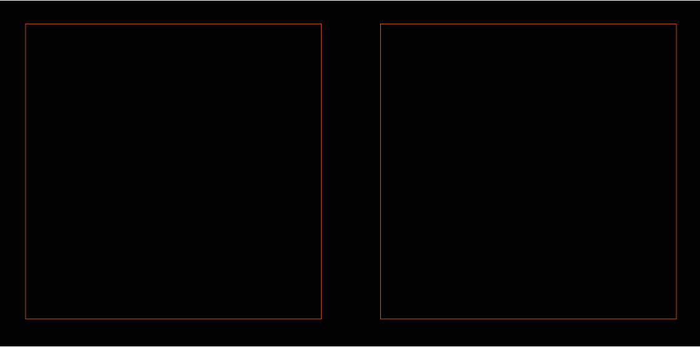

# Example: Two Square Boxes

Example 2.11.1 from Ucamco's `The Gerber Layer Format Specification - Revision 2023.03`.
As a outcome of code from this example, two square boxes are expected to be created.

